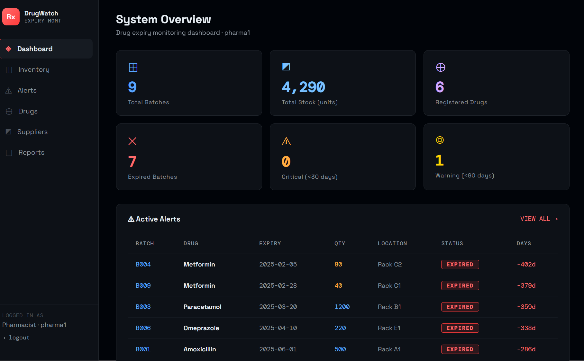
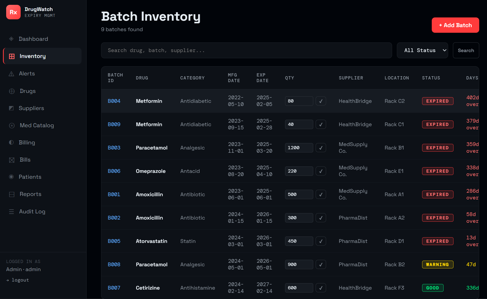
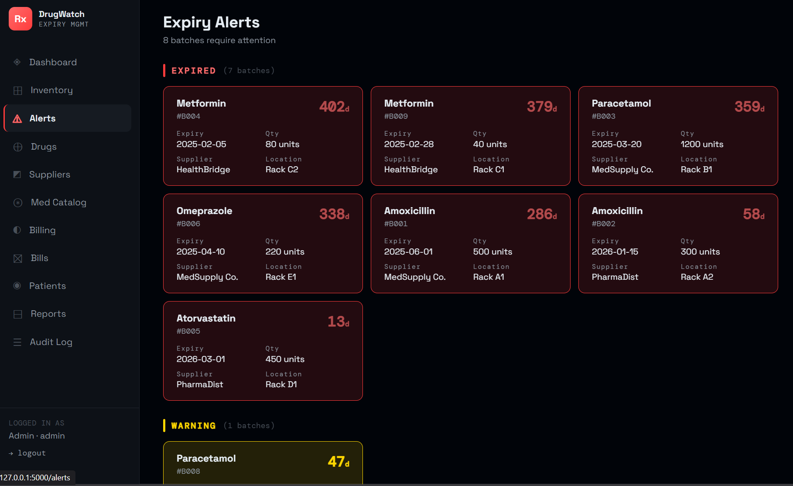
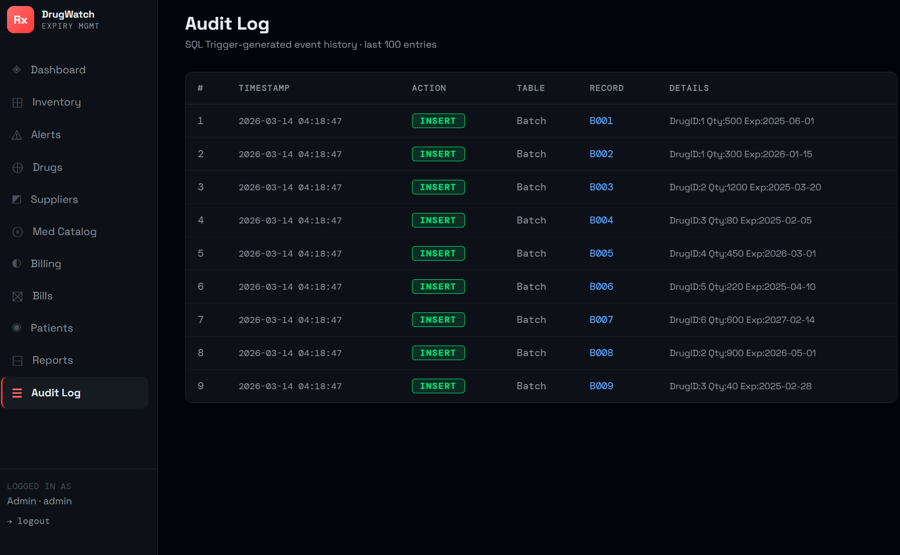

# 💊 DrugWatch — Drug Expiry Management System

> A full-stack web application for managing drug inventory, tracking expiry dates, dispensing medicines, and maintaining patient records — built with Python (Flask) and SQLite.

**DBMS University Project** | B.Tech CSE | KIIT University

---

## 👥 Team Members

| Name | Roll No |
|------|---------|
| Ayush Kumar | 24155916 |
| Anubhab Das | 24155906 |
| Abhijoy Debnath | 24155928 |
| Aditya Sengupta | 24155302 |

---

## 🎯 Project Overview

DrugWatch is a **Database Management System** project that solves a real-world healthcare problem — managing drug expiry dates in pharmacies and hospitals. Many small medical facilities rely on manual record-keeping which leads to human errors and delayed updates. This system automates expiry tracking, generates alerts, manages patient billing, and ensures safe drug usage.

---

## ✨ Features

### 📊 Dashboard
- **Admin Dashboard** — live stats, recent bills, expiry alerts, DB activity log
- **Pharmacist Dashboard** — task-focused view with only relevant alerts and low stock

### 💊 Inventory Management
- View, search and filter all drug batches
- Add new batches with supplier, location, expiry date
- Inline stock quantity update
- Color-coded expiry status — Good / Warning / Critical / Expired

### ⚠️ Alerts Center
- Expired batches (with days overdue)
- Critical batches (expiring within 30 days)
- Warning batches (expiring within 90 days)
- Low stock alerts (below 100 units)

### 🧾 Billing System
- Live medicine search with stock and price
- Add multiple medicines to cart
- Supports registered patients or walk-in customers
- Apply discount and GST
- Choose payment method — Cash, Card, UPI, Net Banking, Cheque
- **Atomic transaction** — stock deducted and bill saved together (all or nothing)
- PDF receipt generated instantly

### 👥 Patient Management
- Register patients with auto-generated `CUST-XXXXXX` IDs
- View complete purchase history per patient
- Edit and search patient records
- Bills preserved even if patient is removed

### 📄 Bills History
- View all bills with search and date range filter
- Full bill detail view with line items
- Download any bill as a **PDF receipt**

### 🗃️ Medicine Catalog
- 248,000+ real medicines imported from Kaggle dataset
- Search by name or filter by therapeutic class
- View side effects, uses, substitutes, chemical class for any medicine

### 📈 Reports
- Expiry status distribution (progress bars)
- Stock breakdown by category and supplier
- Revenue by payment method
- Top therapeutic classes in catalog

### 🔍 Audit Log *(Admin only)*
- Every database change automatically logged by SQL triggers
- Full history of INSERT, UPDATE, DELETE operations

---

## 🗄️ Database Design

### Tables (9)

| Table | Description |
|-------|-------------|
| `Drug` | Medicines registered in pharmacy inventory |
| `Batch` | Individual stock batches with expiry dates |
| `Supplier` | Supplier directory |
| `MedicineCatalog` | 248k+ medicines from real dataset |
| `Patient` | Patient / customer records |
| `Bill` | Dispensing bills |
| `BillItem` | Line items for each bill |
| `Users` | System users with roles |
| `AuditLog` | Auto-populated by triggers |

### Views (4)

```sql
vw_Inventory        -- Full inventory with computed expiry status
vw_ExpiredBatches   -- Expired batches with days overdue
vw_ExpiringBatches  -- Batches expiring within 90 days
vw_BillSummary      -- Bills joined with patient and item count
```

### Triggers (4)

```sql
trg_batch_insert      -- Logs every new batch → AuditLog
trg_batch_delete      -- Logs every batch deletion → AuditLog
trg_batch_qty_update  -- Logs stock quantity changes → AuditLog
trg_bill_insert       -- Logs every new bill → AuditLog
```

### Constraints
- `CHECK(quantity >= 0)` on Batch
- `CHECK(role IN ('admin','pharmacist'))` on Users
- `CHECK(quantity > 0)` on BillItem
- `FOREIGN KEY` with `ON DELETE CASCADE` and `ON DELETE SET NULL`
- `NOT NULL` on critical fields
- `UNIQUE` on bill numbers and usernames

---

## 🛠️ Tech Stack

| Layer | Technology |
|-------|-----------|
| Backend | Python 3, Flask |
| Database | SQLite3 |
| Frontend | HTML, CSS, JavaScript |
| PDF Generation | ReportLab |
| Dataset | Kaggle Medicine Dataset (248k rows) |

---

## 🚀 Getting Started

### Prerequisites
- Python 3.8 or higher
- pip

### Installation & Run

```bash
# 1. Clone the repository
git clone https://github.com/YOUR_USERNAME/drugwatch.git
cd drugwatch

# 2. Install dependencies
pip install flask reportlab

# 3. Run the app
python app.py
```

Then open your browser at: **http://127.0.0.1:5000**

> ⚠️ First run imports 248k medicines from the dataset — takes ~30 seconds. After that it's instant.

---

## 🔐 Login Credentials

| Role | Username | Password | Access |
|------|----------|----------|--------|
| 👑 Admin | `admin` | `admin123` | Full access — manage everything, view audit log |
| 💊 Pharmacist | `pharma1` | `pharma123` | Update stock, create bills, view inventory |

---

## 📁 Project Structure

```
drugwatch/
├── app.py                  ← Flask application (all routes + embedded SQL schema)
├── schema.sql              ← SQL schema for documentation & reference
├── medicine_dataset.csv    ← 248k+ medicine catalog (Kaggle dataset)
├── README.md
└── templates/
    ├── base.html           ← Shared layout + sidebar navigation
    ├── login.html
    ├── dashboard_admin.html
    ├── dashboard_pharma.html
    ├── inventory.html
    ├── alerts.html
    ├── drugs.html
    ├── billing.html        ← Live cart with AJAX drug/patient search
    ├── bills.html
    ├── bill_detail.html
    ├── patients.html
    ├── patient_detail.html
    ├── catalog.html
    ├── medicine_detail.html
    ├── suppliers.html
    ├── reports.html
    └── audit.html
```

---

## 📸 Screenshots

### Dashboard


### Inventory


### Alerts


### Billing


### Audit log


---

## 📚 DBMS Concepts Demonstrated

- ✅ Entity-Relationship (ER) Modeling
- ✅ Relational Schema Design
- ✅ Normalization (3NF)
- ✅ SQL DDL (CREATE TABLE, constraints)
- ✅ SQL DML (INSERT, UPDATE, DELETE, SELECT)
- ✅ Views (virtual tables for complex queries)
- ✅ Triggers (automatic audit logging)
- ✅ Foreign Keys & Referential Integrity
- ✅ Transactions (atomic billing)
- ✅ Role-based Access Control

---

## 📄 License

This project is submitted as part of the DBMS course at KIIT University. For educational purposes only.
